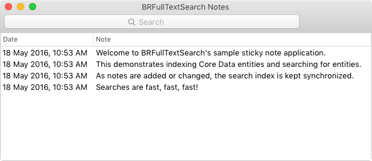

# BRFullTextSearch OS X sample project

This project is a sample OS X application that integrates `BRFullTextSearch` via CooaPods. It allows adding small text "notes" which are stored in Core Data. The search index is maintained by responding to changes in Core Data.

# Usage

The app will start off with a few sample notes, shown in a table.

 * **Add a note** by using the **File > New** menu (⌘N)
 * **Edit a note** by double-clicking on a row in the note list.
 * **Delete a note** by double-clicking on a row in the note list, then click the *Delete* button.
 * **Search notes** by clicking in the search field and typing. The results will replace the full list of notes.
 * **Return to the full note list** after searching by clearing the search field.
